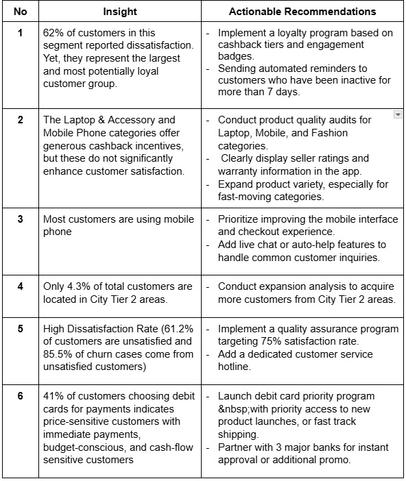

# Bradlees Customer Churn Analysis: An EDA and Machine Learning Approach
## Author Profiles:
- **Abdillah Zaraaifa** – [abdillah.zaraa@gmail.com](mailto:abdillah.zaraa@gmail.com) | [LinkedIn](https://www.linkedin.com/in/abdillah-zaraaifa-al-farisa)
- **Abdul Hadi** – [hadiabdul13@gmail.com](mailto:hadiabdul13@gmail.com) | [LinkedIn](https://www.linkedin.com/in/abdul-hadi-447608159/)
- **Anas Putra Aghazy** – [anasagazy99@gmail.com](mailto:anasagazy99@gmail.com) | [LinkedIn](https://www.linkedin.com/in/anas-putra-agazy-4192142a3/)

## Overview
This project focuses on customer churn analysis for Bradlees, an e-commerce platform, aiming to identify customers who are at risk of leaving or disengaging. The workflow involves exploratory data analysis (EDA), interactive dashboards, and the application of machine learning models. Among the various evaluation metrics, Recall is prioritized, as failing to identify potential churners is considered more costly than misclassifying loyal customers. 

Furthermore, this project emphasizes the calculation and optimization of customer retention costs, estimating how much budget is needed to retain customers identified as high-risk. By combining predictive modeling with cost-focused analysis, the project provides actionable insights and business recommendations to support more efficient and targeted retention strategies.

## Dataset
The data set belongs to Bradlees, a leading online E-Commerce company. An online retail (E commerce) company wants to know the customers who are going to churn, so accordingly they can approach customer to offer some promos. Source from [Kaggle](https://www.kaggle.com/datasets/ankitverma2010/ecommerce-customer-churn-analysis-and-prediction/).

## Business Background and Objectives
Bradlees is a growing digital business that values long-term customer relationships as a core driver of sustainable growth. Like many companies in the competitive e-commerce landscape, Bradlees faces the challenge of retaining customers who may gradually disengage or churn.

This project was initiated to help Bradlees develop a data-driven customer retention strategy. By analyzing historical customer behavior and applying machine learning models, with a focus on Recall and retention cost optimization, the project aims to:

- Identify high-risk churn customers
- Support targeted and cost-efficient retention efforts
- Minimize revenue loss and improve marketing effectiveness
- Provide actionable insights to enhance long-term profitability

Through this approach, Bradlees can shift from reactive to proactive engagement, strengthen customer loyalty, and make smarter, data-driven business decisions

## Technologies Used:
This project leverages a variety of Python-based tools and libraries to perform data preprocessing, modeling, evaluation, and interpretation:

- Python 3: The main programming language used for the entire workflow, due to its robust ecosystem for data science and machine learning.
- Jupyter Notebook: Used as the primary development environment, allowing for interactive coding, visualization, and documentation in a single interface.
- Scikit-learn: Utilized for machine learning model implementation, preprocessing pipelines, model evaluation metrics, and cross-validation strategies.
- Machine Learning Algorithms: A diverse set of classifiers were explored to compare performance and robustness, including: (1) XGBoost and LightGBM: Gradient boosting frameworks known for high accuracy and speed; (2) Gradient Boosting, AdaBoost: Ensemble methods that combine weak learners to form a strong classifier; (3) Logistic Regression, Decision Tree, Random Forest, Bagging Tree: Baseline and tree-based models used for benchmarking and ensemble learning.
- Pandas, NumPy: For data manipulation, cleaning, and numerical operations.
- Seaborn, Matplotlib: For data visualization and plotting performance metrics and distributions.
- SHAP (SHapley Additive exPlanations): Applied for model explainability, to understand feature contributions and interpret the reasoning behind model predictions.

## Project Workflow
- Business Understanding: Define the main objective: reduce customer churn and improve retention strategies, with a strong focus on the Recall metric.
- Data Cleaning & Preprocessing: Handle missing values, encode categorical features, and build a transformation pipeline for consistent data processing.
- Exploratory Data Analysis (EDA): Explore customer behavior patterns and feature relationships to understand key churn indicators.
- Feature Engineering: Create new relevant features to enhance model performance and predictive accuracy.
- Modeling & Evaluation: Train and evaluate various machine learning models with resampling techniques, prioritizing Recall to capture high-risk customers.
- Cost-Benefit Analysis and SHAP: Combine retention cost analysis with SHAP-based model interpretation to understand churn drivers and assess cost-effectiveness of interventions.
- Recommendations: Provide actionable, data-driven strategies to support targeted and efficient customer retention efforts.

## Key Results
Based on the results of EDA and RF analysis, we segmented customers into several groups, ranging from loyal to those at risk of churn. This enables targeted business interventions and more effective customer retention efforts.

We conducted three experiments:
1. Baseline model - the initial model with only basic preprocessing such as handling duplicates and missing values;
2. Feature engineering model - a model improved through insights gained from exploratory data analysis (EDA);
3. Final model -  a simplified model using only the most important variables influencing churn.

Based on the comparison of several machine learning models, we selected LightGBM (LGBM) with Random Over Sampling Technique (ROS) as the final model due to its highest accuracy in churn prediction. The comparison of LGBM performance across these three experiments is presented below:

Based on the LGBM (LightGBM) analysis, there are only 12 features that influence Churn, ranked according to their feature importance as follows:

 

The SHAP analysis for the selected LGBM model is presented as follows:

- Tenure: Customers with shorter tenure (red) are more likely to churn.
- Customers who have complained (blue) show higher churn risk.
- Order Count: Fewer orders = higher churn risk.
- Cash on Delivery: COD users tend to churn more.

## Business Impact
This project includes a simulation to estimate retention cost savings by using a machine learning model to predict customer churn. The goal is to reduce unnecessary retention expenses by targeting only the customers predicted to churn.

In the initial scenario, a flat retention offer costing $20 per customer is applied to all customers in the dataset without any machine learning support, resulting in a total retention cost of $101,420. This assumes that every customer receives a retention incentive regardless of their actual likelihood to churn.

To optimize the process, a churn prediction model is applied. Based on the model’s predictions on the test set, only 345 customers are predicted to churn, leading to a significantly reduced retention cost of $6,900 on the test data. Since the test set represents 30% of the full dataset, we extrapolate the predicted cost to the entire dataset, which yields an estimated retention cost of $23,000 when using the model's predictions.

By comparing both strategies, the machine learning-based approach results in a cost reduction of $78,420, demonstrating the value of predictive analytics in making targeted business decisions and maximizing efficiency in retention campaigns.

## Business Recommendation
Based on the results of the exploratory data analysis (EDA), the following business recommendations are proposed:

## Dashboard
Explore the interactive dashboard for a visual summary of the findings:

- Customer Churn Analysis Dashboard ([Link Looker Studio](https://lookerstudio.google.com/reporting/312c0447-6a47-4206-89dd-6538268ec073/))

